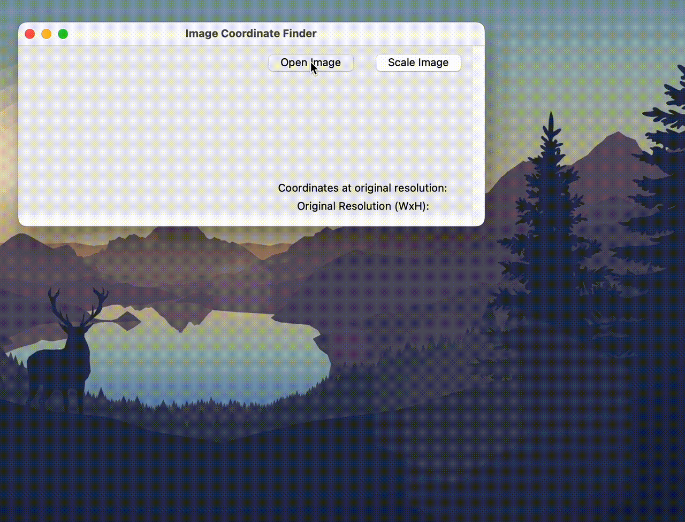

# Image Coordinates Finder
This is a simple tool that displays specified coordinates in an image at its original scale.

# Confirmed environment
- macOS Ventura (13.6.4)
- Apple M1
- Python (3.10.9)

Other environments should work, but not confirmed.

# How to build runnable binary file
```bash
pip install -r requirements.txt
pyinstaller --onefile --noconsole --icon=icon.ico --name="Image Coordinate Finder"  main.py
# Then double click the `Image Coordinate Finder` file in the `dist` directory.  
```
It may take a little time to start after clicking.

# How to use

